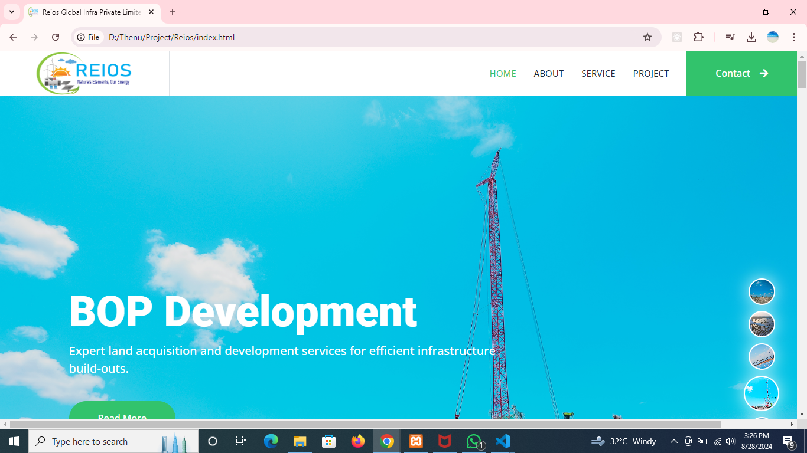
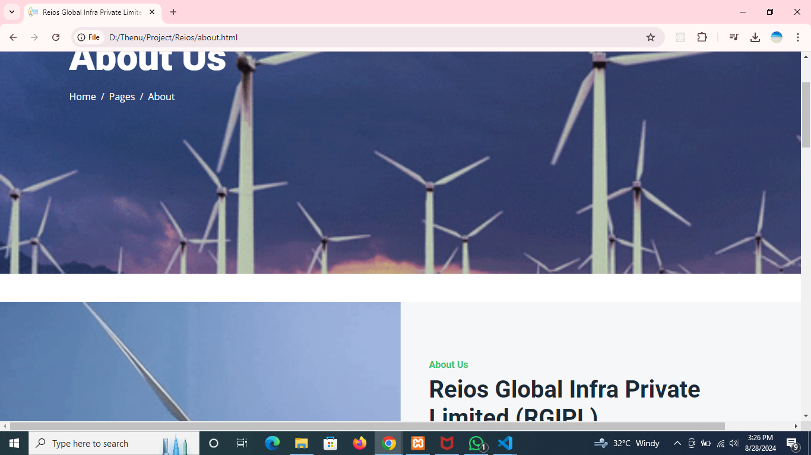
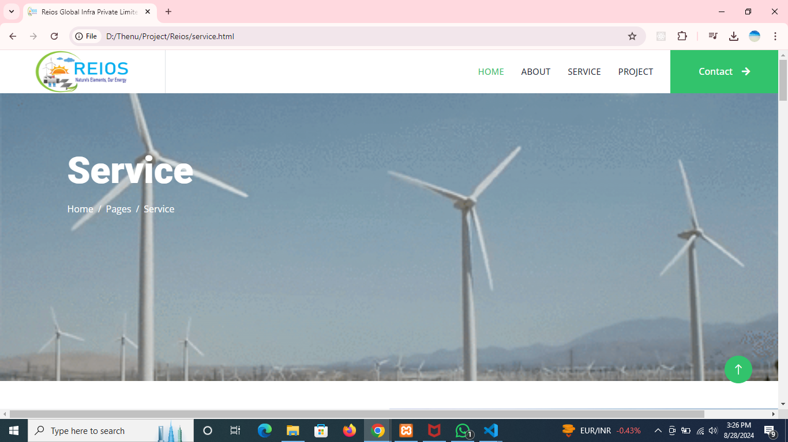
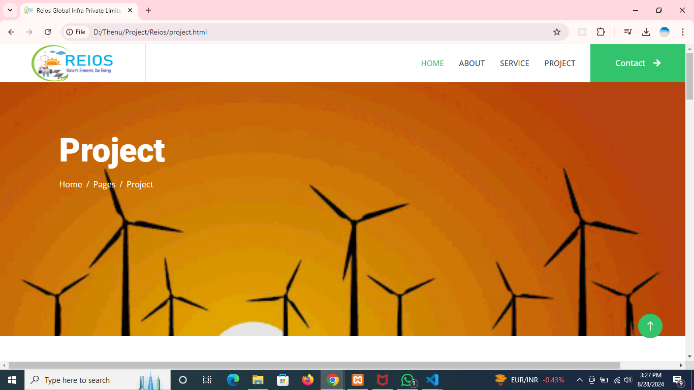
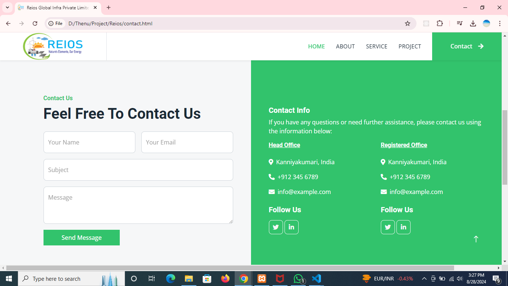

Follow the Steps
    1.Download the (.zip fil)/https://github.com/MJTHENU/Reios.git
    Results:  your path location 

Screenshots

<video width="600" controls>
  <source src="./screenshot/Reios Global Infra Private Limited _ Renewable Energy Solutions - Google Chrome 2024-08-28 15-25-53.mp4" type="video/mp4">
  Your browser does not support the
</video>